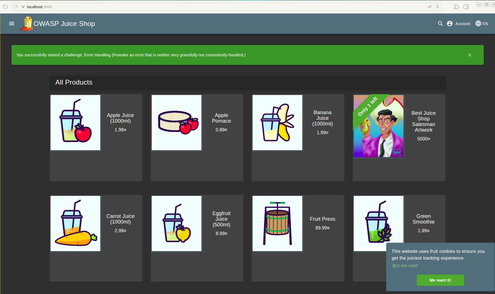
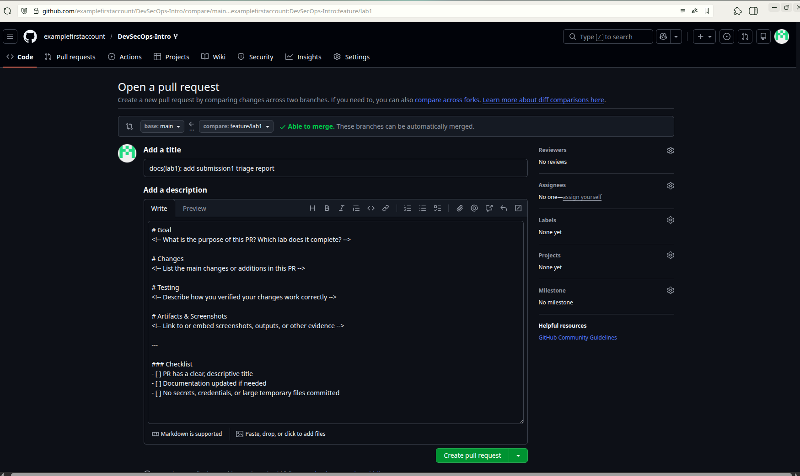

# Triage Report — OWASP Juice Shop

## Scope & Asset
- Asset: OWASP Juice Shop (local lab instance)
- Image: bkimminich/juice-shop:v19.0.0
- Release link/date: https://github.com/juice-shop/juice-shop/releases/tag/v19.0.0 — September 4, 2025
- Image digest (optional): sha256:2765a26de7647609099a338d5b7f61085d95903c8703bb70f03fcc4b12f0818d

## Environment
- Host OS: Ubuntu 24.04
- Docker: 29.1.3

## Deployment Details
- Run command used: `docker run -d --name juice-shop -p 127.0.0.1:3000:3000 bkimminich/juice-shop:v19.0.0`
- Access URL: http://127.0.0.1:3000
- Network exposure: 127.0.0.1 only [X] Yes  [ ] No

## Health Check
- Page load: 
- API check:

    Original endpoint from lab instructions `curl -s http://127.0.0.1:3000/rest/products | head` gives:
    ```html
    <html>
    <head>
        <meta charset='utf-8'>
        <title>Error: Unexpected path: /rest/products</title>
        <style>* {
    margin: 0;
    padding: 0;
    outline: 0;
    }
    ```

    Working endpoint found during testing `curl -s "http://127.0.0.1:3000/rest/products/search?q=" | head` gives:
    ```json
    {"status":"success","data":[{"id":1,"name":"Apple Juice (1000ml)","description":"The all-time classic.","price":1.99,"deluxePrice":0.99,"image":"apple_juice.jpg","createdAt":"2026-02-09 06:52:26.771 +00:00","updatedAt":"2026-02-09 06:52:26.771 +00:00","deletedAt":null},
    ```

## Surface Snapshot (Triage)
- Login/Registration visible: [X] Yes  [ ] No — notes: Account button visible in top-right navigation bar, if you click on it then Login button appears
- Product listing/search present: [X] Yes  [ ] No — notes: Main page displays product cards with images, prices, and search bar at top
- Admin or account area discoverable: [X] Yes  [ ] No — notes: Account menu accessible after login at the same place where was Login button
- Client-side errors in console: [X] Yes  [ ] No — notes: Single warning about deprecated feature used in `content.js:213`: "Unload event listeners are deprecated and will be removed."
- Security headers (quick look — optional):
    ```http
    HTTP/1.1 200 OK
    Access-Control-Allow-Origin: *
    X-Content-Type-Options: nosniff
    X-Frame-Options: SAMEORIGIN
    Feature-Policy: payment 'self'
    X-Recruiting: /#/jobs
    Accept-Ranges: bytes
    Cache-Control: public, max-age=0
    Last-Modified: Mon, 09 Feb 2026 06:52:27 GMT
    ETag: W/"124fa-19c412c49d5"
    Content-Type: text/html; charset=UTF-8
    Content-Length: 75002
    Vary: Accept-Encoding
    Date: Mon, 09 Feb 2026 07:50:11 GMT
    Connection: keep-alive
    Keep-Alive: timeout=5
    ```

    Quick analysis:
    - `X-Content-Type-Options` and `X-Frame-Options` present (MIME-type sniffing and basic clickjacking protection)
    - Missing `Content-Security-Policy (CSP)`
    - Missing `Strict-Transport-Security (HSTS)`
    - Overly premissive CORS

## Risks Observed (Top 3)
1) **Missing Content-Security-Policy (CSP) header**: Absence of CSP allows unrestricted script execution, making the application highly vulnerable to Cross-Site Scripting (XSS) attacks and malicious code injection
2) **Overly permissive CORS policy (Access-Control-Allow-Origin: \*)** — Allows any external website to make API requests to the application, enabling potential data theft and unauthorized API access from malicious sites
3) **Missing HTTP Strict-Transport-Security (HSTS) header** — Without HSTS, users are vulnerable to man-in-the-middle attacks and SSL stripping, allowing attackers to downgrade connections to insecure HTTP

# PR Template

## Creation

**Location:** `.github/pull_request_template.md` (committed to main branch)

**Template Structure:**
- **Goal** — Purpose and lab identification
- **Changes** — Summary of modifications
- **Testing** — Verification steps performed
- **Artifacts & Screenshots** — Evidence and documentation
- **Checklist** — Pre-submission validation (clear title, docs updated, no secrets)

**Process:**
1. Created `.github/pull_request_template.md` on main branch
2. Committed with message: `docs: add PR template`
3. Pushed to fork's main branch
4. Created PR from `feature/lab1` to verify auto-fill functionality

## Verification



**Observation:** Template successfully auto-populated when opening PR from `feature/lab1` → course repository main branch. All sections (Goal, Changes, Testing, Artifacts & Screenshots) and checklist items appeared automatically in PR description.

**Impact on Workflow:**
PR templates standardize submission format across all labs, ensuring consistency and completeness. They serve as checklists to prevent missing required documentation, improve code review efficiency, and establish clear communication patterns in collaborative development environments.

# GitHub Community

## Actions Completed
- Starred course repository: [inno-devops-labs/F25-DevSecOps-Intro](https://github.com/inno-devops-labs/F25-DevSecOps-Intro)
- Starred [simple-container-com/api](https://github.com/simple-container-com/api) project
- Followed Professor [@Cre-eD](https://github.com/Cre-eD)
- Followed TA [@marat-biriushev](https://github.com/marat-biriushev)
- Followed TA [@pierrepicaud](https://github.com/pierrepicaud)
- Followed 3 classmates from the course: [@kolsmer](https://github.com/kolsmer), [@ArthurBabkin](https://github.com/ArthurBabkin), [@DmitriyProkopyev](https://github.com/DmitriyProkopyev)

## Reflection

**Why Starring Matters:**
Starring repositories serves as both a personal bookmarking system and a community signal that encourages open-source maintainers while helping projects gain visibility through GitHub's discovery algorithms and search rankings.

**Why Following Matters:**
Following developers enables continuous learning from peers' contributions, facilitates professional networking beyond the classroom, and builds collaborative relationships that support both current team projects and long-term career growth in the software development community.
