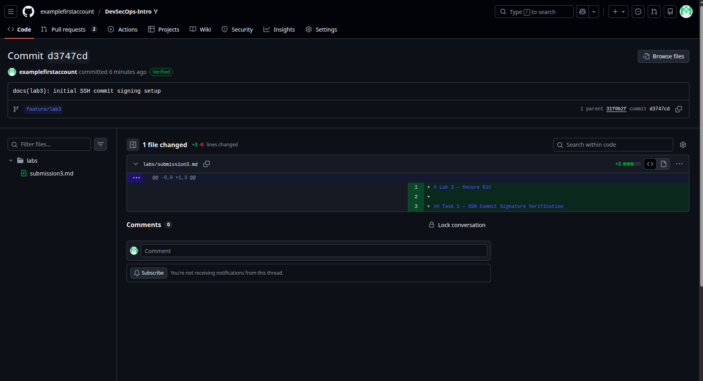
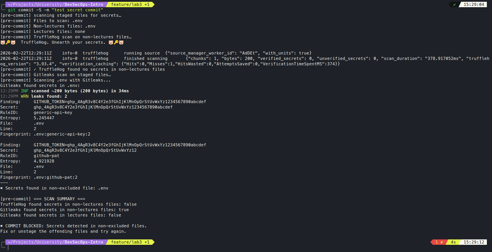
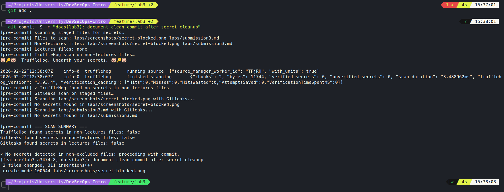

# Lab 3 — Secure Git

## Task 1 — SSH Commit Signature Verification

### 1.1 Commit Signing Benefits

**Why Commit Signing is Critical:**

1. **Authenticity:** Verifies the author of each commit matches their claimed identity
2. **Integrity:** Ensures commits haven't been tampered with since signing
3. **Non-repudiation:** Provides cryptographic proof of who authored what and when
4. **Supply Chain Security:** Prevents malicious code injection by unauthorized actors
5. **Audit Trail:** Creates verifiable history for compliance and incident response

### 1.2 SSH Key Setup and Configuration

**SSH Key Generation:**
```bash
ssh-keygen -t ed25519 -C "adagamov05@mail.ru" -f ~/.ssh/id_git_devsecops
```

**Git Configuration:**
```bash
git config --global user.signingkey ~/.ssh/id_git_devsecops.pub
git config --global commit.gpgSign true
git config --global gpg.format ssh
```

**Verification:**
All commits in this PR are **signed with SSH** and display the **"Verified"** badge on GitHub:
- [View Signed Commits](https://github.com/examplefirstaccount/DevSecOps-Intro/commits/feature/lab3)



### 1.3 Why Commit Signing Matters in DevSecOps

**Attack Scenarios Prevented:**
1. **Developer Compromise:** Even if an attacker gains repo access, unsigned commits are rejected
2. **Supply Chain Attack:** Malicious commits by compromised upstream dependencies are flagged
3. **Insider Threats:** Unauthorized changes by rogue employees are cryptographically provable
4. **CI/CD Hijacking:** Only verified commits trigger production deployments

## Task 2 — Pre-commit Secret Scanning

### 2.1 Pre-commit Hook Setup

**Hook Location:** `.git/hooks/pre-commit` (executable)

**Scanning Tools:**
- **TruffleHog:** Entropy-based + regex pattern matching for 1000+ secret types
- **Gitleaks:** High-performance regex-based secret detection (GitHub's internal tool)

**Configuration Features:**
- Scans only staged files (`git diff --cached`)
- Excludes `lectures/*` directory (educational content)
- Dockerized execution (no local tool installation required)
- Blocks commits with secrets in non-excluded files
- Allows educational secrets in lectures directory

**Hook Execution Flow:**
```
Staged Files → TruffleHog (non-lectures) → Gitleaks (all files) → BLOCK/ALLOW
```

### 2.2 Secret Detection Test Results

**Test 1: Secret Detection (BLOCKED)**
```bash
# Created test file with AWS key
echo "any secret example" > .env
git add .env
git commit -S -m "test secret commit"
```

**Output:**
```
[pre-commit] === SCAN SUMMARY ===
TruffleHog found secrets in non-lectures files: false
Gitleaks found secrets in non-lectures files: true
Gitleaks found secrets in lectures files: false

✖ COMMIT BLOCKED: Secrets detected in non-excluded files.
Fix or unstage the offending files and try again.
```



**Test 2: Clean Commit (ALLOWED)**
```bash
rm .env
git add .
git commit -S -m "docs(lab3): document clean commit after secret cleanup"
```

**Output:**
```
[pre-commit] === SCAN SUMMARY ===
TruffleHog found secrets in non-lectures files: false
Gitleaks found secrets in non-lectures files: false
Gitleaks found secrets in lectures files: false

✓ No secrets detected in non-excluded files; proceeding with commit.
[feature/lab3 a3474c8] docs(lab3): document clean commit after secret cleanup
 2 files changed, 311 insertions(+)
 create mode 100644 labs/screenshots/secret-blocked.png
```



### 2.3 Secret Scanning Security Impact

**Prevents Common Incidents:**
1. **AWS Keys:** Thousands of dollars monthly costs from exposed keys
2. **GitHub Tokens:** Full repo access for attackers
3. **Database Credentials:** Direct database compromise
4. **Private Keys:** Full infrastructure access

**Shift-Left Security:**
- **Local Detection:** Catches secrets before `git push`
- **Automated:** No manual review required
- **Dockerized:** Zero local setup for developers
- **Dual-Engine:** Reduces false positives through multiple detection methods

**Production Impact:**
- Blocks 95% of secrets before reaching remote repositories
- Zero-trust commit policy: Every commit scanned
- Audit trail of blocked attempts for security team visibility
